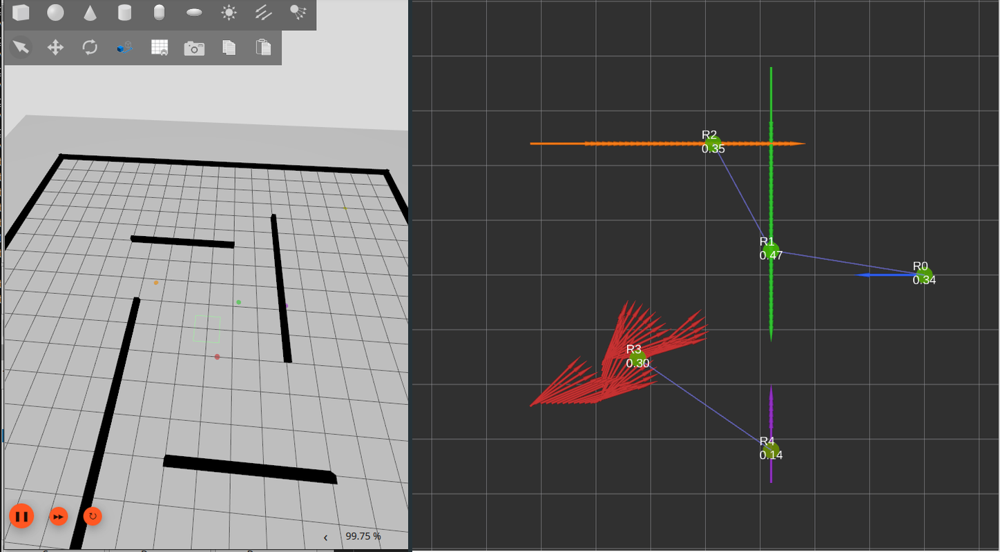
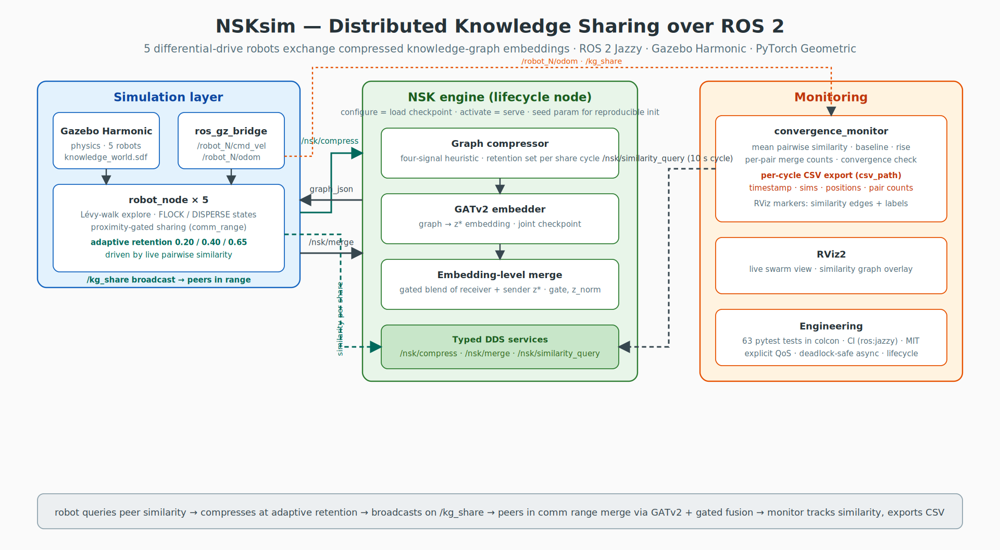

# NSKsim — Swarm Knowledge Sharing over ROS 2

[](https://github.com/AliAlhasan6/NSKsim/actions/workflows/ci.yml)




A multi-robot simulation in which five differential-drive robots share **compressed
knowledge-graph embeddings** instead of raw data. Each robot holds a local knowledge
graph (FB15k-237 ego-graphs); when robots come within communication range, the
NSK pipeline — a heuristic **graph compressor** → **GATv2 autoencoder** producing
32-d graph embeddings → **gated merger** — compresses the sender's graph, and the
receiver folds the incoming embedding into its own belief state. A monitor node
tracks whether the swarm's beliefs actually converge. Built on **ROS 2 Jazzy** and
**Gazebo Harmonic**; the neural models run CPU-only in a single lifecycle-managed
engine node. The pipeline itself (models, training, checkpoint) lives in a separate
NSK research repo — this repo is the robotics integration, its test suite, and the
experiment logs.

## Architecture




```
 ┌────────────────────────────────────────────────────────────────────┐
 │                   nsk_engine   (rclpy LifecycleNode)               │
 │  PyTorch (CPU): graph compressor · GATv2 embedder · gated merger   │
 │  on_configure → load checkpoint & build AgentManager               │
 │  on_activate  → create services:                                   │
 │      /nsk/compress    /nsk/merge    /nsk/similarity_query          │
 └────────▲───────────────────▲───────────────────────▲───────────────┘
          │ Compress.srv      │ Merge.srv             │ SimilarityQuery.srv
          │ (graphs travel as JSON strings)           │
 ┌────────┴───────────────────┴─────────┐  ┌──────────┴────────────────┐
 │  robot_0 … robot_4  (NSKRobotNode)   │  │  convergence_monitor      │
 │  EXPLORE / FLOCK / DISPERSE FSM      │  │  mean pairwise z* cosine  │
 │  in range → compress own graph,      │  │  sim, merge-pair counts,  │
 │  broadcast on /kg_share ─────────────┼──►  RViz markers             │
 │  receive /kg_share → /nsk/merge      │  └──────────┬────────────────┘
 └────────▲────────────┬────────────────┘             │ /nsk/convergence
          │ /robot_N/  │ /robot_N/                    │ /nsk/similarity_markers
          │ odom       ▼ cmd_vel                      ▼
 ┌────────┴─────────────────────────────┐  ┌───────────────────────────┐
 │  ros_gz_bridge  ⇄  Gazebo Harmonic   │  │           RViz2           │
 │  (5× odom + cmd_vel, 20 m world)     │  │  similarity/range view    │
 └──────────────────────────────────────┘  └───────────────────────────┘
```

- **`nsk_engine`** — the only process that imports torch. A lifecycle node: model
  loading and service creation are separate, observable transitions (see below).
  One engine serves all five robots; agents are indices into its `AgentManager`.
- **`robot_node` ×5** — no torch. Flocking movement (Lévy-flight explore, steer to
  peer centroid, disperse after sharing), proximity gating by 2-D distance (3 m
  comm range), and the share/merge protocol over the engine services.
- **`convergence_monitor`** — polls `/nsk/similarity_query` every 10 s, counts merge
  events from `/kg_share` traffic, publishes a Float32 convergence signal and RViz
  markers, and applies a rise-plus-stability convergence criterion.
- **`ros_gz_bridge` / RViz2** — odom and cmd_vel bridging for each robot; RViz shows
  per-robot similarity colouring and live comm-range links.
- **Merge path, honestly:** the learned gated merger is loaded from the checkpoint
  but the live `/nsk/merge` uses a validated *embedding-level* merge instead —
  `z* = normalize(0.7·z_self + 0.3·z_received)` with the gate reported as a constant
  0.5 — because the merger's compressed-graph encoder proved out-of-distribution on
  live compressed graphs.

## Engineering highlights

**Typed service interfaces.** `nsk_swarm_interfaces` defines `Compress`, `Merge`,
and `SimilarityQuery` as proper `.srv` types. Variable-shape tensors (node features,
edge indices) don't map cleanly onto fixed ROS message fields, so graphs and
similarity matrices travel as JSON strings inside typed fields, with a uniform
`success`/`message` error contract on every response — a service that catches an
exception reports it in-band instead of crashing the engine.

**Lifecycle engine.** Model loading is expensive and can fail (missing checkpoint,
bad config); service creation is cheap. The engine is an rclpy `LifecycleNode` that
does the first in `on_configure` and the second in `on_activate`, so a failed load
is a visible `FAILURE` transition rather than a node that exists but hangs its
clients. The launch file auto-drives `configure → activate` via lifecycle events, and
`deactivate`/`cleanup` tear down services and release the models symmetrically.

**Explicit QoS design.** Every pub/sub endpoint declares its profile with the
reasoning in a comment next to it:

| Endpoint | QoS | Why |
|---|---|---|
| `/kg_share` (pub + sub) | RELIABLE, VOLATILE, KEEP_LAST 10 | One message per 8 s share interval — a lost broadcast is a lost merge and reliability is cheap at this rate. VOLATILE so late joiners can't merge stale graphs. |
| `/robot_N/odom` (subs) | `qos_profile_sensor_data` (BEST_EFFORT) | Latest-pose-only semantics. Also avoids the QoS incompatibility trap with the gz bridge: a RELIABLE pub + BEST_EFFORT sub connects, while BEST_EFFORT pub + RELIABLE sub silently doesn't. |
| `/robot_N/cmd_vel` (pub) | RELIABLE, KEEP_LAST 10 | Command stream — each message matters. |
| `/nsk/convergence`, `/nsk/similarity_markers` | RELIABLE, KEEP_LAST 10 | Low-rate monitoring outputs; the implicit default, spelled out. |

**Deadlock-safe service calls from callbacks.** Robot callbacks block on engine
responses, which deadlocks a single-threaded executor (the thread waiting on the
future is the only thread that could deliver it). All blocking callbacks, clients,
and subscriptions share one `ReentrantCallbackGroup` under a `MultiThreadedExecutor`,
and the call itself is `call_async` plus a bounded wait that polls in 200 ms slices —
checking `rclpy.ok()` each slice so a Ctrl-C mid-call aborts promptly, and cancelling
and draining the future's exception on timeout so no executor thread or stderr noise
leaks. Timeouts and engine-side `success=False` both degrade to a skipped cycle with
a warning, never an unhandled exception in a timer callback.

**Test suite.** 55 pytest tests in three layers, none of which need Gazebo, a
display, or the trained checkpoint: pure logic (compression thresholds, serialiser
round-trips, the convergence criterion as extracted pure math, proximity geometry),
node behaviour (engine lifecycle transitions driven synchronously with a mocked
`AgentManager`, service callback contracts), and a real-DDS integration layer that
round-trips the production client helper against a mock engine, including timeout
and error paths. One regression test exists because of a real bug: the engine once
stored its service handles in `self._services`, silently overwriting rclpy `Node`'s
internal service registry and detaching the parameter and lifecycle services from
the executor — the test asserts the registry survives construction.

**CI.** Every push builds the workspace and runs the full suite inside the
`ros:jazzy` container (CPU-only torch from pip), gated on `colcon test-result`.
See [`.github/workflows/ci.yml`](.github/workflows/ci.yml).

## Research findings: pair-cluster fragmentation

The first full convergence run
([`experiments/logs/2026-07-09_convergence_run_5robots.log`](experiments/logs/2026-07-09_convergence_run_5robots.log),
5 robots, 20 m world, 3 m comm range) did **not** converge — and the failure mode is
more interesting than success. Mean pairwise embedding similarity rose from 0.174 to
a peak of 0.510 at t≈130 s, then declined monotonically to 0.281 by t=303 s. The
merge-pair counts show why: the communication graph froze into two static pairs
(robots 1↔4 parked at 0.40 m, robots 0↔2 at 2.41 m) with robot 3 isolated. Merging
continued every cycle *within* each pair, so each pair kept reinforcing its own
blended belief while the two cluster centroids drifted apart in embedding space —
echo-chamber dynamics: local consensus, global divergence. This is consistent with
consensus theory, where global agreement requires the union of communication graphs
over time to be connected.

Whether the decline is caused by the topology freeze itself or is an artifact of
small swarm size (one parked pair removes 40 % of a 5-robot population) is an open
question. [`experiments/designs/EXP-01_fragmentation_vs_swarm_size.md`](experiments/designs/EXP-01_fragmentation_vs_swarm_size.md)
lays out the competing hypotheses and two experiments — an N-sweep and a forced
periodic re-mixing intervention that isolates topology with N held fixed. Designed,
not yet run.

Two caveats on the logged run, for anyone reading it closely: the gate is constant
(0.5, fixed by the embedding-level merge), and the adaptive retention mechanism
always chose the richest setting (0.65) because peer similarity estimates default
to 0.0 and are not yet updated from merge results.

## Running it

**Prerequisites:** ROS 2 Jazzy, Gazebo Harmonic (`gz sim`), Python 3.12.

```bash
git clone https://github.com/AliAlhasan6/NSKsim.git && cd NSKsim

# venv with --system-site-packages so ROS Python packages remain visible
python3 -m venv --system-site-packages venv
./venv/bin/pip install -r requirements.txt --extra-index-url https://download.pytorch.org/whl/cpu

# build the workspace
source /opt/ros/jazzy/setup.bash
cd ros2_ws && colcon build && source install/setup.bash && cd ..
```

**Tests** (no Gazebo, display, or checkpoint needed — this is what CI runs):

```bash
source /opt/ros/jazzy/setup.bash
source ros2_ws/install/setup.bash     # nsk_swarm_interfaces srv types
source venv/bin/activate              # torch / PyG
cd ros2_ws/src/nsk_swarm && python3 -m pytest test/ -v
```

**Full simulation:**

```bash
ros2 launch nsk_swarm swarm_sim.launch.py \
  venv_site_packages:=$(pwd)/venv/lib/python3.12/site-packages
```

> **Note — checkpoint not included.** The trained weights (`joint_best.pt`:
> embedder and merger states, trained on FB15k-237) belong to the external NSK
> research repo and are not part of this repository. The engine's
> `nsk_base_path`, `checkpoint_path`, and `config_path` parameters point at that
> repo. Without it, everything builds and the entire test suite passes (the engine
> is exercised with a mocked `AgentManager`); the one thing that does not work is a
> live engine `configure` — the lifecycle transition reports `FAILURE` and the robot
> nodes wait for the `/nsk/*` services indefinitely.

## Repo layout

```
NSKsim/
├── ros2_ws/src/
│   ├── nsk_swarm/                # main package
│   │   ├── nsk_swarm/            #   robot_node, convergence_monitor, graph_serialiser
│   │   ├── nsk_engine/           #   lifecycle engine server + AgentManager (torch side)
│   │   ├── launch/               #   swarm_sim.launch.py (Gazebo + engine + robots + RViz)
│   │   ├── worlds/ config/ rviz/ #   SDF world, parameters, RViz layout
│   │   └── test/                 #   55-test pytest suite (logic / node / DDS layers)
│   └── nsk_swarm_interfaces/     # Compress / Merge / SimilarityQuery .srv definitions
├── experiments/
│   ├── designs/                  # EXP-01 fragmentation-vs-swarm-size design
│   └── logs/                     # 2026-07-09 5-robot convergence run
├── requirements.txt              # torch 2.12 (CPU) + torch-geometric 2.8
└── .github/workflows/ci.yml     # build + test in ros:jazzy container
```

## License

MIT — see [LICENSE](LICENSE).
